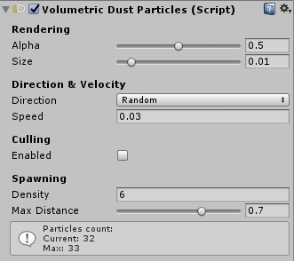
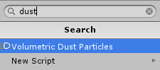
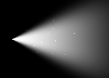
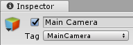
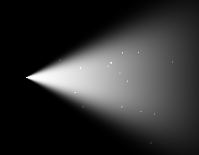
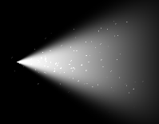
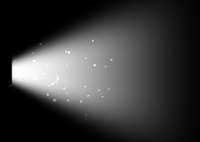
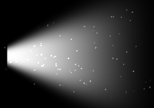

# Volumetric Dust Particles Component

The *Volumetric Dust Particles* feature is designed to simulate highly detailed dustlight / mote effects. These particles are rendered using *Shuriken*.

!!! info " Supported Unity version"
    *Volumetric Dust Particles* feature is only supported in **Unity 5.5 or above**.

!!! warning "Performance consideration"
    Since this feature relies on particles, depending on the number of particles you want to display, this could be performance intensive. That's why a [culling system](#culling) is built-in in this component: when enabled, the particles which are too far away from the camera (and so which would be barely visible) won't be rendered, saving on performance.

!!! tip
    We do not recommend to use this feature if you plan to move or change properties of the beam during playtime.

------
## Usage
The *Volumetric Dust Particles* component must be attached to a [*Volumetric Light Beam*](comp-lightbeam.md). It lets you easily customize the rendering, density and movement of the particles in the inspector.

You can attach this component via:

+ The **Add Dust Particles** button and context menu from the [*Volumetric Light Beam*](comp-lightbeam.md) component.  

+ The **Add Component** panel.  

------
## Rendering

### Alpha
Max opacity of the particles.

### Size
Max size of the particles.

|||
|:--:|:--:|
|0.01|0.02|

------
## Direction & Velocity

### Direction
Direction of the particles.

+ **Cone**: particles follows the cone/beam direction.
+ **Random**: random direction.

### Speed
Movement speed of the particles.

------
## Culling
### Enabled
Enable particles culling based on the distance to the Main Camera. We highly recommend to enable this feature to keep good runtime performances.

!!! note ""
    In order to use this feature, you must have a camera tagged as *MainCamera* in your scene.  
    

### Max Distance
The particles will not be rendered if they are further than this distance to the Main Camera.

------
##  Spawning

### Density
Controls how many particles are spawned. The higher the density, the more particles are spawned, the higher the performance cost is.

|||
|:--:|:--:|
|Density: 5 (28 particles max)|Density: 25 (140 particles max)|

### Max Distance
The maximum relative distance (from the light source) where the particles are spawned. The lower it is, the more the particles are gathered near the light source.

|||
|:--:|:--:|
|0.5 (half distance)|1.0 (max distance)|