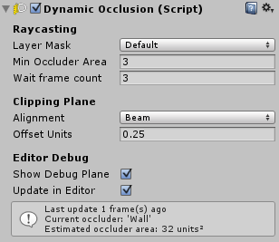
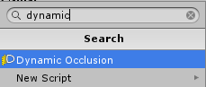

# Dynamic Occlusion Component

The *Dynamic Occlusion* feature gives awareness to your light beams: they react to the changes in the environment. Light Beams can be blocked/occluded by geometry.

Without this feature, [*Volumetric Light Beam*](comp-lightbeam.md) are not blocked by geometry: think about it like a *Light* with disabled shadows. This means that if you place a light beam against a wall, the light beam could shine through it and be visible from the other side.

This feature relies on raycasts to be aware of potential occluders. When enabled, regular raycasts are performed in the light beam direction. If an occluder is found, a clipping plane is computed from the occlusion test results, and is fed to the light beam. 

!!! info "Raycasts and Colliders"
    Since this features relies on raycasts to work, ***a piece of geometry MUST be represented with a physical entity for Unity in order to be considered as a potential occluder***. This means a **3D Collider** component MUST be attached to it (BoxCollider, SphereCollider, MeshCollider...).

!!! warning "Performance consideration"
    Depending on the complexity of your scene, performing regular raycasts could be performance intensive. There are 3 main points to take into considerations when using this feature:

    + Enable this feature on a light beam only if it's really necessary.
    + Tweak the [*Layer Mask*](#layer-mask) property to be as restrictive as possible.
    + Tweak the [*Wait frame count*](#wait-frame-count) property to prevents from performing raycasts at each frame.

------
## Usage
The *Dynamic Occlusion* component must be attached to a [*Volumetric Light Beam*](comp-lightbeam.md).

You can attach this component via:

+ The **Add Dynamic Occlusion** button and context menu from the [*Volumetric Light Beam*](comp-lightbeam.md) component.  

+ The **Add Component** panel.  

------
## Raycasting
### Layer Mask
On which layers the beam will perform raycasts to check for colliders.  

!!! tip "Performance consideration"
    Try to set a *Layer Mask* as restrictive as possible (checking only the layers which are necessary) to perform more efficient raycasts in order to increase the performance.

### Min Occluder Area
Minimum 'area' of the collider to become an occluder.  
Colliders smaller than this value will not block the beam.

### Wait frame count
How many frames the system will wait before performing the next occlusion tests (raycast)?

+ If you want your beam to be super responsive to the changes of your environment, update it every frame by setting 1.  
+ If you want to save on performance, we recommend to wait few frames between each update by setting a higher value. For example with the value 3, the system will perform 1 raycast every 3 frames.

------
## Clipping Plane
### Alignment
Alignment of the computed clipping plane:

+ **Surface**: align to the surface normal which blocks the beam. Works better for large occluders such as floors and walls.
+ **Beam**: keep the plane aligned with the beam direction. Works better with more complex occluders or with corners.

### Offset Units
Apply a translation to the plane. We recommend to set a small positive offset in order to handle non-flat surface better.

------
## Editor Debug
### Show Debug Plane
Draw debug plane on the scene view.

### Update in Editor
Perform occlusion tests and raycasts in Editor.
