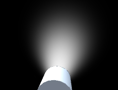

# Volumetric Light Beam Component

The *VolumetricLightBeam* component is the main component of the plugin. It can be attached to any GameObject.


## Enabling / Disabling
The Volumetric Light Beam enabling/disabling mechanism has been designed the same way Unity handles Lights: using the *enabled* property.  
If you want to turn on/off only the beam from script, you can change the *enabled* property of the component:
```
var beam = GetComponent<VLB.VolumetricLightBeam>();
beam.enabled = false; // turn off the beam (and the beam only)
```

!!! note ""
    If a *VolumetricLightBeam* component is attached on the same GameObject than a *Light*, disabling the *Light* component will not disable the beam (the light and the beam are 2 distinct components).

Additionally you can turn on/off both the light and the beam, by simply set the GameObject active/inactive: `gameObject.SetActive(false);`

------

## Basic
### Spot Angle
Define the angle (in degrees) at the base of the beam's cone.

||||
|:--------:|:--------:|:--------:|
|25 degrees|45 degrees|90 degrees|

!!! note ""
    If attached to a Spotlight, check the toggle *From Spot* to get the same value than the *Spot Angle* Light's property.

### Color
Use the color picker to set the color of the beam (takes account of the alpha value).

!!! note ""
    If attached to a Spotlight, check the toggle *From Spot* to get the same value than the *Color* Light's property.

### Side Thickness
Thickness of the beam when looking at it from the side.

+ 1.0 = the beam is fully visible with hard edges.
+ Lower values produce softer transition at beam edges.

||||
|:--:|:--:|:--:|
|0.0|0.75|1.0|

!!! tip
    If you set the lowest possible value and want to make the beam even thinner, just lower the [*Spot Angle*](#spot-angle) and/or the [*Truncated Radius*](#truncated-radius) properties.

###  Track Changes During Playtime
If true, the light beam will keep track of the changes of its own properties and the spotlight attached to it (if any) during playtime. This would allow you to modify the light beam in realtime from Script, Animator and/or Timeline.

!!! note ""
    Enabling this feature is at very minor performance cost. So keep it disabled if you don't plan to modify this light beam during playtime.

------
## Inside
### Alpha
Modulate the opacity of the inside geometry of the beam. Is multiplied to [*Color's alpha*](#color).

### Glare (frontal)
Boost intensity factor when looking at the beam from the inside directly at the source.

|||
|:--:|:--:|
|0.0|1.0|

------
## Outside
### Alpha
Modulate the opacity of the outside geometry of the beam. Is multiplied to [*Color's alpha*](#color).

### Glare (from behind)
Boost intensity factor when looking at the beam from behind.

|||
|:--:|:--:|
|0.0|1.0|

------
## Attenuation
### Equation
Attenuation equation used to compute fading between *Fade Start Distance* and *Range Distance*.

+ **Linear**: Simple linear attenuation.
+ **Quadratic**: Quadratic attenuation. Since this is the way light behaves in real life, this usually gives more realistic results than the linear attenuation.
+ **Blend**: Custom blending mix between linear and quadratic attenuation (can be customize using a slider).

||||
|:--:|:--:|:--:|
|Linear|Blend (factor 0.5)|Quadratic|

### Range Distance
Maximum distance (in units) of the light beam. After this distance, the beam is entirely faded out.  

!!! note ""
    If attached to a Spotlight, check the toggle *From Spot* to get the same value than the *Range* Light's property.

### Fade Start Distance
Distance from the light source (in units) the beam intensity will start to fall off.

||||
|:--:|:--:|:--:|
|0%|25%|50%|

------
## 3D Noise
3D Noise is a feature to simulate volumetric fog / mist / smoke effects on the beams.  
To achieve that, a tiled 3D noise texture is internally used.

!!! warning "Platform specific"
    Since mobile platforms cannot handle 3D textures, this feature is currently not supported on mobile.

### Enabled
Enable the 3D Noise effect.

!!! bug "Known issue with WebGL in Editor"
    For some reason, 3D textures (and so 3D Noise) are not working in Editor if WebGL is set as the current platform. But the 3D Noise works totally fine in the browser if you export a WebGL build... So as a workaround, and until this bug is fixed by Unity, this feature is temporary disabled in Editor with WebGL.

### Intensity
Higher intensity means the noise contribution is stronger and more visible.

||||
|:--:|:--:|:--:|
|0.0 (disabled)|0.5|1.0|

### Scale
3D Noise texture scaling. Higher scale makes the noise more visible, but potentially less realistic because the texture tiling could become more apparent.

||||
|:--:|:--:|:--:|
|0.4|0.8|1.4|

!!! note ""
    If the toggle **Use Global** is checked, it will use [the global **Scale** property set in *configuration file*](config.md#scale).

### Velocity
Vector3 property defining the world space direction (the direction of the vector) and speed (the magnitude of the vector) of the noise scrolling, simulating the fog/smoke movement.

!!! tip
    We recommend to tweak this property during playtime, because depending on the Unity version you use, the texture scrolling is not updated every frame.

!!! note ""
    If the toggle **Use Global** is checked, it will use [the global **Velocity** property set in the *configuration file*](config.md#velocity).

------
## Soft Intersections Blending Distances

### Camera
Because the volumetric beams are rendered using cone geometry, it is possible for the camera to intersect with the geometry, which could produce unwanted artifacts. This property is designed to fix this issue. It specifies the distance between the beam geometry and the camera's near clip plane where the beam will start to fade, making a smoother transition.  

+ 0.0 = hard intersection with the camera's near clip plane.  
+ Higher values produce soft intersection when the camera is near the cone geometry.

|||
|:--:|:--:|
|0.0|0.25|

### Opaque Geometry
Distance from the world geometry the beam will fade.

+ 0.0 = hard intersection with world's geometry. 
+ Higher values produce soft intersection when the beam intersects other opaque geometry.

|||
|:--:|:--:|
|0.0|1.0|

!!! note ""
    To support this feature, the rendering camera must use `DepthTextureMode.Depth`.  
    By default, the plugin will enforce this property to all cameras attempting to render a beam. If you want to disable this behavior for some reason, you can comment the following line in *BeamGeometry.cs* : `#define FORCE_CURRENT_CAMERA_DEPTH_TEXTURE_MODE`.

!!! info "Platform specific"
    The quality of this feature is highly depend on the depth buffer precision. On platforms with low precision Z buffer such as mobile, it's recommended to keep a small depth range on your cameras clip planes: the difference between the near and far clip planes should be as low as possible.

------
## Cone Geometry
### Truncated Radius
Radius (in units) at the beam's source (the top of the cone).

+ 0.0 will generate perfect cone geometry (with a sharp apex).
+ Higher values will generate truncated cones.

|||
|:--:|:--:|
|0.0|0.25|

!!! note ""
    Increasing the *Truncated Radius* property will not increase the [*Spot Angle*](#spot-angle). This means that the cone's maximum radius is not dependent on the *Truncated Radius* property.

### Sides
Number of Sides of the cone (tessellation). Higher values give better looking results, but require more memory and graphic performance.

|||
|:--:|:--:|
|8 sides|32 sides|

!!! note ""
    Changing the *Sides* property at runtime is not supported (even if the [*Track Changes During Playtime*](#track-changes-during-playtime) property if enabled), because it would require to regenerate the beam mesh, which would be too performance intensive.

### Cap Geom
Show the cap of the cone or not (only visible from the inside).

|||
|:--:|:--:|
|Off|On|

!!! note ""
    Even if the [*Truncated Radius*](#truncated-radius) is 0.0, the *Cap Geom* property is still important to consider, since the [*Truncated Radius*](#truncated-radius) can be changed in realtime.

!!! note ""
    Changing the *Cap Geom* property at runtime is not supported (even if the [*Track Changes During Playtime*](#track-changes-during-playtime) property if enabled), because it would require to regenerate the beam mesh, which would be too performance intensive.