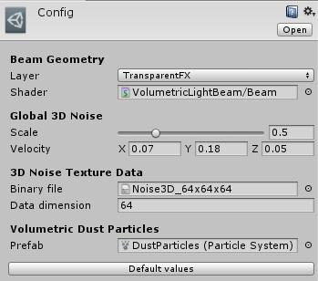

# Configuration
In your project file, look for a file named **Config.asset** under the *Plugins/VolumetricLightBeam/Resources* folder. In the inspector, you can configure the following properties.

------
## Beam Geometry

### Layer
Controls on which layer the beam geometry meshes will be created in. Default layer is *TransparentFX*.

### Shader
Main shader applied to the cone beam geometry.

!!! warning
    We highly recommend to keep this property default value.

------
## Global 3D Noise

### Scale
Global 3D Noise texture scaling. Higher scale make the noise more visible, but potentially less realistic.

### Velocity
Vector3 property defining the global World Space direction and speed of the noise scrolling, simulating the fog/smoke movement.

------
## 3D Noise Texture Data

### Binary file
Binary file holding the 3D Noise texture data (a 3D array). Must be exactly Size x Size x Size bytes long.

### Data dimension
Size (of one dimension) of the 3D Noise data. Must be power of 2. So if the binary file holds a 32x32x32 texture, this value must be 32.

------
##  Volumetric Dust Particles

### Prefab
ParticleSystem prefab instantiated for the Volumetric Dust Particles feature (Unity 5.5 or above).