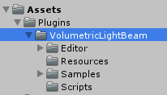
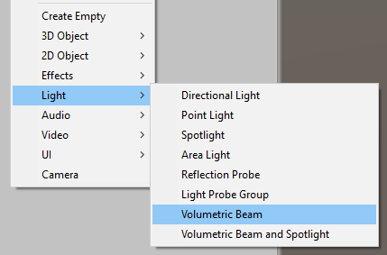
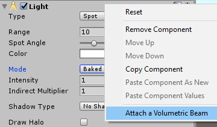
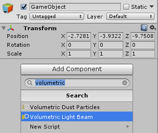

# Home
[***Volumetric Light Beam***](http://u3d.as/WQU) is a 5-stars-rated asset available for the Unity engine, which greatly **improve the lighting of your scene** by generating **truly volumetric procedural beams of light** / light shafts rays effects.  
This is a perfect, **easy and cheap way to simulate density, depth and volume** for your spotlights and/or flashlights.

[**>> Get it on the AssetStore <<**](http://u3d.as/WQU)

<iframe src="https://api.assetstore.unity3d.com/affiliate/embed/package/99888/widget-wide" style="width:600px; height:130px; border:0px;"></iframe>

This is the Documentation of the Volumetric Light Beam plugin version **1.31**.

Please consider rating and writing a review on the [**Asset Store page**](http://u3d.as/WQU) if you like it! Thanks :)

------
## Resources
### Videos
#### Showcase
<iframe width="560" height="315" src="https://www.youtube.com/embed/-zLNKNHn-XM" frameborder="0" gesture="media" allow="encrypted-media" allowfullscreen></iframe>

#### How to create your first Volumetric Light Beam
<iframe width="560" height="315" src="https://www.youtube.com/embed/q2IdxuJ0fk0" frameborder="0" gesture="media" allow="encrypted-media" allowfullscreen></iframe>

### Demos
+ [**WebGL Demo**](http://saladgamer.com/unitywebdemo/volumetriclightbeam/)
+ [**WebGL Stress test**](http://saladgamer.com/unitywebdemo/volumetriclightbeam_stresstest/)

### Contact
+ Have a look of the [**Forum Thread**](https://forum.unity.com/threads/released-volumetric-light-beam.499367/) if you want to share something with the community.
+ Feel free to [**reach us**](mailto:techsaladunity@gmail.com) if you need help or to suggest some improvements/features!

------
## Getting Started
### Install the plugin
Get the plugin on the [**AssetStore**](http://u3d.as/WQU) and import it. The plugin installs the necessary files into a folder *Assets/Plugins/VolumetricLightBeam* in your project.  
  

!!! info "Supported Unity versions"
    *Volumetric Light Beam* is compatible with all Unity versions from *5.2.0* to the latest *2017.X* releases.

And that's it! You can start to create new volumetric lights!

### Create your first light beam

In the Unity's *Create* menu, browse to *Light*, and choose either one of the new entity:

+ *Volumetric Beam*: creates a new standalone beam of light (no lights attached).
+ *Volumetric Beam and Spotlight*: creates a new Spot-light with a beam of light attached to it.  

In addition, you can attach a [*VolumetricLightBeam*](comp-lightbeam.md) component to:

+ An existing *Spotlight* (right click on the inspector)  

+ An existing GameObject (via the *Add Component* button)  

